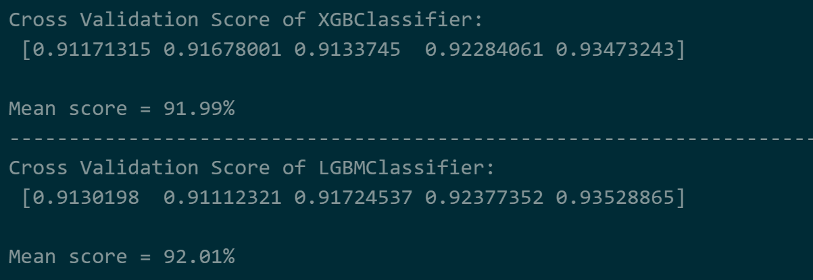
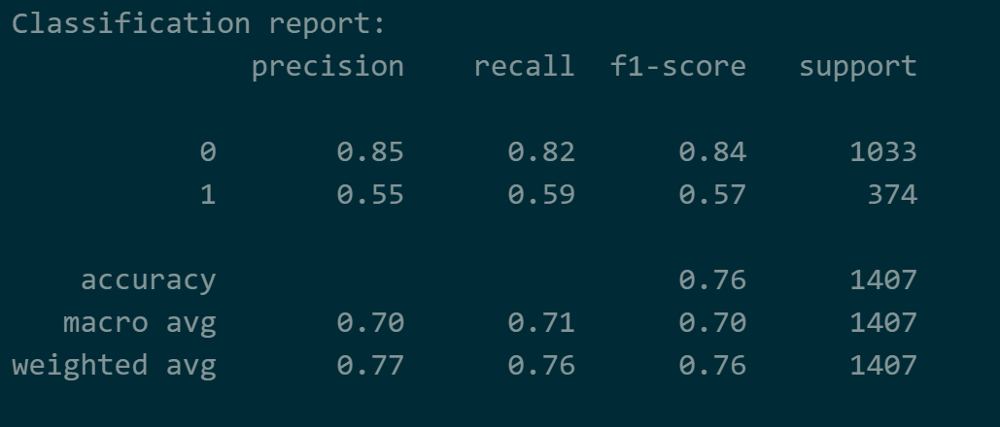
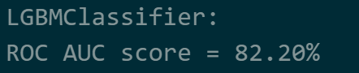

# Laporan Proyek Machine Learning - Gusti Ayu Putu Erika Erlina


### **Domain Proyek:**
Telekomunikasi adalah suatu industri yang mencakup semua perusahaan dan organisasi yang menyediakan layanan komunikasi jarak jauh, termasuk telepon, internet, dan siaran televisi. Pertumbuhan telekomunikasi sangat pesat dari waktu ke waktu sehingga memunculkan berbagai macam perusahaan telekomunikasi. Contohnya saja di Indonesia, berdasarkan capaian PDB dalam kurun waktu empat tahun (sumber BPS 2018), salah satu sektor yang terus bertumbuh paling tinggi di kisaran 8%-10% adalah sektor komunikasi dan informasi. 

Berdasarkan perhitungan nilai CR (*concentration ratio*), industri yang dilakukan pada empat perusahaan telekomunikasi terbesar di Indonesia dengan total keseluruhan 95,26%, tiap perusahaan memiliki pangsa pasar yang bervariasi. Pangsa pasar dalam tiap perusahaan mencerminkan dominasi oleh beberapa pemain utama, persaingan tajam dan kontrol harga yang signifikan, tetapi tetap saling bergantung satu sama lain. Dengan nilai CR4 yang berada di antara 60%-100% dapat mengakibatkan struktur pasar oligopoli yang ketat. Kondisi demikian menyebabkan setiap pengambilan keputusan dari suatu perusahaan dapat memberikan dampak bagi perusahaan lain dan setiap kebijakan harga yang dibuat harus diperhatikan. Contohnya, pada tahun 2017, terjadinya kerugian disebabkan oleh tarif murah yang mengerek jumlah pelanggan secara signifikan, tetapi peningkatan trafik yang melonjak drastis tidak sepadan dengan pendapatan yang diterima. 

*Churn* adalah suatu kondisi dimana pelanggan tidak melanjutkan menggunakan layanan atau berhenti berlangganan yang disebabkan oleh beberapa hal. Sedangkan pelanggan jangka panjang penting untuk keberlangsungan perusahaan. Kemudian, *churn rate* adalah persentase pelanggan yang berhenti. Tingkat *churn* tinggi mengakibatkan penurunan pangsa pasar dan pendapatan perusahaan. Penyebab *customer churn* bisa disebabkan oleh beberapa faktor seperti pelayanan yang buruk, pindah lokasi, harga, situasi pesaing yang lebih menjanjikan, kecepatan internet, dan sebagainya. Dengan kondisi persaingan industri telekomunikasi yg sangat intens atau kompetitif maka akan meningkatkan persaingan industri di berbagai faktor yang ada demi menjaga retensi atau hubungan *customer* jangka panjang. Dengan demikian, diperlukannya suatu tolak ukur atau indikator untuk mengatur strategi perilaku, bisnis, dan pemasaran yang ada untuk mempertahankan pelanggan serta mengevaluasi situasi dan merancang paket layanan yang sesuai. Oleh karena itu, dibuatlah sebuah model *machine learning* untuk memprediksi apakah seseorang memiliki kecenderungan untuk *churn* atau tidak. Dengan adanya model *machine learning*, diharapkan perusahaan telekomunikasi dapat lebih waspada mengenai pelanggan-pelanggan yang berpotensi untuk *churn* untuk mempertahankan pelanggan yang sudah ada.

**Referensi:**
* [Analisis Industri Telekomunikasi Seluler di Indonesia Pendekatan SCP Structure Conduct Performance](https://www.researchgate.net/publication/348609455_Analisis_Industri_Telekomunikasi_Seluler_di_Indonesia_Pendekatan_SCP_Structure_Conduct_Perfoemance)
* [Telecom Customer Churn Prediction Analysis](https://www.researchgate.net/publication/376829074_Telecom_Customer_Churn_Prediction_Analysis)
* [Factors Influence Customer Churn on Internet Service Providers in Indonesia](https://e-journal.unair.ac.id/TIJAB)

### **Business Understanding:**
Berdasarkan latar belakang, berikut ini adalah rumusan masalah yang dapat diselesaikan:

**Problem Statements**:
* Bagaimana proses analisis EDA dapat membantu dalam memahami distribusi masing-masing fitur, hubungan antar fitur, serta interaksi kompleks antara beberapa fitur untuk mengidentifikasi pola yang mungkin mempengaruhi prediksi churn pelanggan? 
* Bagaimana cara mengidentifikasi layanan-layanan yang paling berpengaruh terhadap kecenderungan pelanggan untuk churn, sehingga perusahaan dapat mengoptimalkan strategi retention?
* Bagaimana memperoleh model machine learning yang sesuai dengan kebutuhan industri telekomunikasi dan dapat memberikan insight yang relevan bagi keputusan bisnis?

**Goals**:
* Mendapatkan wawasan yang lebih dalam tentang pola dan hubungan antar fitur dalam data.
* Mengidentifikasi layanan-layanan yang paling berpengaruh terhadap kecenderungan churn pelanggan, dengan fokus pada perbaikan dan pengoptimalan layanan tersebut untuk meningkatkan kepuasan dan retensi pelanggan.
* Mengembangkan model machine learning yang tepat guna untuk mengatasi masalah churn pelanggan di industri telekomunikasi, yang dapat memberikan prediksi yang akurat serta menyediakan wawasan yang dapat membantu perusahaan dalam merumuskan strategi bisnis yang lebih efektif.

**Solution Statements**:
* Untuk memahami distribusi dan hubungan antar fitur, dilakukan analisis univariate untuk mengevaluasi distribusi tiap fitur, bivariate untuk memahami hubungan antar dua fitur, dan multivariate untuk melihat interaksi yang lebih kompleks antar banyak fitur. 

* Untuk mengidentifikasi layanan yang paling berpengaruh terhadap churn pelanggan, digunakan uji independensi chi-squared untuk data kategorik (misalnya, jenis layanan) dan uji ANOVA untuk data numerik (misalnya, total tagihan atau durasi berlangganan). Uji-uji ini memungkinkan identifikasi fitur-fitur yang memiliki hubungan signifikan dengan kecenderungan churn pelanggan, yang kemudian dapat digunakan untuk strategi retention.
* Penggunaan dua algoritma seperti XGBoost dan LightGBM untuk menemukan model yang sesuai dan mampu mengatasi masalah imbalanced classification binary serta memberikan performa yang baik dalam waktu yang relatif cepat.
     * Cara kerja XGBoost (Extreme Gradient Boosting):
          * Menggunakan teknik boosting, di mana model dibangun secara bertahap untuk memperbaiki kesalahan model sebelumnya.
          * Menerapkan regularisasi untuk menghindari overfitting dan memastikan generalisasi yang baik.
          * Menggunakan decision tree sebagai dasar model, namun dengan pendekatan yang lebih canggih untuk mengoptimalkan hasil.

     * Cara kerja LightGBM (Light Gradient Boosting Machine):
          * Menggunakan teknik leaf-wise growth pada pohon keputusan, yang memungkinkan pembelajaran lebih efisien.
          * Melakukan pembagian data secara histogram untuk mempercepat komputasi dan mengurangi penggunaan memori.
          * Menerapkan regularisasi untuk meningkatkan kemampuan generalisasi dan menghindari overfitting.


### **Data Understanding:**
Dataset yang digunakan berisi **7043** baris dan **21** kolom, dengan komposisi tipe data yang dominan berupa **18 kolom bertipe object**, **2 kolom bertipe int64**, dan **1 kolom bertipe float64**. Fitur numerik yang ada antara lain `SeniorCitizen`, `tenure`, dan `MonthlyCharges`, sementara fitur kategorikal mencakup `Partner`, `gender`, dan lainnya. Kolom `customerID` memiliki nilai unik terbanyak, sedangkan data lainnya memiliki antara 2 hingga 4 nilai unik. Kolom `TotalCharges` memiliki tipe data yang tidak sesuai dan perlu diubah tipe datanya agar dapat diproses lebih lanjut. Tidak ditemukan missing values atau data duplikat dalam dataset ini, tetapi terdapat ketidakseimbangan data pada kolom target (churn), dengan jumlah churn "No" sebanyak 5174 dan churn "Yes" sebanyak 1869.

**Sumber Data:** [IBM Telco Churn Repository](https://github.com/IBM/telco-customer-churn-on-icp4d/tree/master/data)

<p align="center">
  <strong>Variabel-Variabel Pada IBM Telco Churn Dataset</strong>
</p>

---
| **Column Name**       | **Description**                                                              | **Values**                                                                                           |
|-----------------------|------------------------------------------------------------------------------|---------------------------------------------------------------------------------------------------------------|
| **customerID**         | ID Pelanggan                                                                  | Unique identifier for each customer                                                                            |
| **gender**             | Jenis kelamin pelanggan                                                       | male, female                                                                                                  |
| **SeniorCitizen**      | Apakah pelanggan merupakan warga senior atau bukan                           | 1, 0                                                                                                          |
| **Partner**            | Apakah pelanggan memiliki pasangan atau tidak                                | Yes, No                                                                                                       |
| **Dependents**         | Apakah pelanggan memiliki tanggungan atau tidak                               | Yes, No                                                                                                       |
| **tenure**             | Jumlah bulan pelanggan telah berlangganan dengan perusahaan                  | Integer value (0-72 months)                                                                                   |
| **PhoneService**       | Apakah pelanggan memiliki layanan telepon atau tidak                         | Yes, No                                                                                                       |
| **MultipleLines**      | Apakah pelanggan memiliki beberapa saluran telepon atau tidak                | Yes, No, No phone service                                                                                     |
| **InternetService**    | Penyedia layanan internet pelanggan                                           | DSL, Fiber Optic, No                                                                                          |
| **OnlineSecurity**     | Apakah pelanggan memiliki keamanan online atau tidak                         | Yes, No, No phone service                                                                                     |
| **OnlineBackup**       | Apakah pelanggan memiliki cadangan online atau tidak                         | Yes, No, No internet service                                                                                  |
| **DeviceProtection**   | Apakah pelanggan memiliki perlindungan perangkat atau tidak                  | Yes, No, No internet service                                                                                  |
| **TechSupport**        | Apakah pelanggan memiliki dukungan teknis atau tidak                         | Yes, No, No internet service                                                                                  |
| **StreamingTV**        | Apakah pelanggan memiliki layanan TV streaming atau tidak                    | Yes, No, No internet service                                                                                  |
| **StreamingMovies**    | Apakah pelanggan memiliki layanan film streaming atau tidak                  | Yes, No, No internet service                                                                                  |
| **Contract**           | Jenis kontrak pelanggan                                                       | Month-to-month, One year, Two year                                                                            |
| **PaperlessBilling**   | Apakah pelanggan menggunakan penagihan tanpa kertas atau tidak               | Yes, No                                                                                                       |
| **PaymentMethod**      | Metode pembayaran pelanggan                                                  | Electronic check, Mailed check, Bank transfer (automatic), Credit card (automatic)                           |
| **MonthlyCharges**     | Jumlah yang dibebankan kepada pelanggan setiap bulan                         | Numeric value                                                                                                 |
| **TotalCharges**       | Jumlah total yang dibebankan kepada pelanggan                                | Numeric value                                                                                                 |
| **Churn**              | Apakah pelanggan berhenti berlangganan atau tidak                            | Yes, No                                                                                                       |
---


#### **Tahapan Memahami Data:**


* Melakukan univariate analysis data kategorik untuk mengevaluasi distribusi tiap fitur.

     
     Mayoritas pelanggan adalah non-lansia, tidak memiliki tanggungan, dan lebih memilih layanan telepon serta internet fiber optic, tetapi jarang berlangganan layanan tambahan. Dalam sistem pembayaran, pelanggan cenderung memilih kontrak bulanan, penagihan tanpa kertas, dan metode pembayaran electronic check, sementara tingkat churn didominasi oleh pelanggan yang tetap bertahan.

* Melakukan univariate analysis data numerik untuk mengetahui distribusi, skewness, dan outlier dalam data.

     
     
     Data `totalcharges` memiliki rentang besar dengan distribusi right-skewed, menunjukkan mayoritas nilai berada di kisaran rendah dan hanya sedikit pelanggan dengan biaya tinggi. Distribusi `tenure` berbentuk U, `monthlycharges` bervariasi dengan konsentrasi sekitar $70-$90, dan tidak ada kolom yang berdistribusi normal, sehingga transformasi atau scaling mungkin diperlukan. Tidak ada outlier di semua data numerik sehingga tidak perlu menangani outlier.

* Melakukan bivariate analysis data kategorik dengan target untuk memahami hubungan antar dua fitur.

     
     
     
     
     Pelanggan dengan kontrak bulanan, penagihan tanpa kertas, dan metode pembayaran electronic check menunjukkan kecenderungan churn yang lebih tinggi, mengindikasikan potensi ketidakpuasan terhadap layanan pembayaran dan fleksibilitas kontrak. Selain itu, pelanggan yang tidak memiliki pasangan, tidak berlangganan layanan tambahan seperti online security atau tech support, serta pengguna fiber optic cenderung lebih sering churn, menunjukkan adanya faktor kepuasan yang perlu dievaluasi. Kesamaan pola churn antara pelanggan dengan satu atau beberapa saluran telepon, serta antara pengguna layanan streaming TV dan movies, mengindikasikan bahwa kualitas layanan bisa menjadi faktor utama dalam keputusan churn.

* Melakukan bivariate analysis data numerik dengan target untuk memahami hubungan antar dua fitur.

     
     Pelanggan yang churn cenderung memiliki masa berlangganan lebih pendek (rata-rata 9 bulan) dan tagihan bulanan lebih tinggi ($80) dibandingkan pelanggan yang tidak churn, yang memiliki rata-rata masa berlangganan 37 bulan dan tagihan $63. Selain itu, total tagihan pelanggan yang churn lebih rendah ($600) dibandingkan yang tidak churn ($1700), menunjukkan bahwa pelanggan churn umumnya meninggalkan layanan lebih awal sebelum akumulasi tagihan menjadi besar.

* Melakukan multivariate analysis untuk melihat interaksi yang lebih kompleks antar banyak fitur:
     
     

     Heatmap menunjukkan adanya korelasi antar beberapa fitur. Dari pair plot terlihat peningkatan masa berlangganan atau tagihan bulanan cenderung meningkatkan total tagihan. Pola segitiga yang terlihat di scatter plot kemungkinan disebabkan oleh distribusi data yang tidak normal dan tingkat variasi data yang tinggi, yang menyebabkan penyebaran data tidak merata.

### **Data Preparation:**
* **Feature Selection**
     ```python
     # uji independensi chi2
     bestfeatures = SelectKBest(score_func=chi2, k=10)

     # uji ANOVA F-value
     bestfeatures = SelectKBest(score_func=f_classif, k=3)
     ```
     Feature selection dilakukan untuk memilih fitur yang paling relevan dan dilakukan menggunakan class `SelectKBest`. Uji chi-square digunakan untuk mengukur hubungan antara fitur kategorikal dengan target dimana sebelumnya data-data kategorik telah diubah menjadi label dengan label encoding, sementara ANOVA F-value digunakan untuk menilai kontribusi fitur numerik terhadap target. Dari hasil uji chi-square, dipilih 10 fitur yang memiliki hubungan kuat dengan churn, sedangkan fitur numerik seperti `tenure` terbukti memiliki korelasi yang signifikan berdasarkan ANOVA. Tahapan ini diperlukan agar model dapat bekerja lebih optimal dengan hanya menggunakan fitur yang paling berpengaruh, mengurangi dimensi data, dan meningkatkan efisiensi pemrosesan.
     
* **Categorical Encoding**
     ```python
     # encoding data kategorik
     df_categoric = df[categorical_columns].copy()

    for col in categorical_columns:
          le = LabelEncoder()
          df_categoric[col] = le.fit_transform(df_categoric[col])
     ```
     Prosesnya adalah memilih kolom-kolom yang memiliki data kategorik. Lalu dilakukanlah label encoding, label encoding dipilih daripada one-hot encoding karena jumlah kategori terbanyak adalah empat. Sehingga dapat menghindari peningkatan dimensi yang berlebihan. Selain itu, label encoding lebih efisien dalam komputasi dan memori, serta tidak memengaruhi performa model karena algoritma yang digunakan tidak sensitif terhadap skala atau urutan numerik.

* **Merge data and Drop Unselected Features**
     ```python
     # membuat dataframe dengan features yang dipilih
     df = pd.concat([df_categoric, df_numeric], axis=1)
     df.drop(columns = columns_to_drop, axis=1, inplace=True)
     ```
     Data kategorik yang telah diencoding menggunakan label encoding digabungkan dengan data numerik ke dalam satu dataframe. Setelah penggabungan, hanya fitur-fitur yang telah dipilih melalui uji chi-square dan ANOVA yang dipertahankan, sementara fitur yang tidak relevan dihapus. Langkah ini bertujuan untuk memastikan bahwa hanya fitur yang memiliki hubungan kuat dengan target yang digunakan dalam proses modeling. Dengan mengurangi fitur yang tidak diperlukan, kompleksitas model dapat dikurangi sehingga meningkatkan efisiensi komputasi. Selain itu, eliminasi fitur yang tidak relevan membantu menghindari overfitting dan meningkatkan generalisasi model terhadap data baru.

* **Train Test Split Data**
     ```python
     # splitting training dan testing data
     X_train, X_test, y_train, y_test = train_test_split(X, y, test_size=0.2, random_state=42)
     ```
     
     
     (Menunjukkan `train_test_split` secara default men-shuffle dataset)

     Setelah memisahkan features (X) dengan target (y). Dataset dibagi menjadi data training (80%) dan data testing (20%) menggunakan *train_test_split*. Data training digunakan untuk melatih model dengan sebanyak mungkin informasi dari dataset, sementara data testing digunakan untuk mengevaluasi performa model pada data yang belum pernah dilihat sebelumnya. Random state diterapkan agar pembagian dataset tetap konsisten setiap kali proses dilakukan ulang. Selain itu, secara default dengan *train_test_split* dataset di-*shuffle* sebelum dibagi untuk memastikan bahwa data training dan testing dipilih secara acak, menghindari model menghafal urutan data yang dapat menyebabkan bias dalam prediksi. Proses train test split digunakan untuk mengevaluasi performa model pada data yang belum pernah dilihat sebelumnya, memastikan generalisasi model.

* **Data Balancing**

     Dilakukan dengan cara:
     ```python
     from imblearn.over_sampling import SMOTE
     smote = SMOTE(random_state=42)
     ```
     Dalam hal ini, SMOTE diterapkan setelah *train-test split*, hanya pada training set, untuk menghasilkan data sintetis dari kelas yang lebih sedikit (dalam kasus ini, pelanggan yang churn) sehingga distribusi kelas menjadi lebih seimbang. Teknik ini berguna karena dataset yang relatif kecil dapat menyebabkan model kekurangan informasi untuk mengenali pola dari kelas minoritas. Dengan menambahkan data sintetis, model memiliki kesempatan lebih besar untuk mempelajari karakteristik dari kedua kelas secara seimbang, sementara testing set tetap dipertahankan dalam distribusi aslinya untuk mengevaluasi performa model secara objektif.

### **Modeling:**
* **List of Models**

     Karena ingin membuat dua model maka dibuatlah list untuk memudahkan proses perbandingan antar model.
     ```python
     models = [
          XGBClassifier(random_state=42), 
          LGBMClassifier(random_state=42, verbose=-1)
     ]
     ```
     * `random_state=42` -> Menjamin hasil yang konsisten setiap kali model dilatih.
     * `verbose=-1` -> Meminimalkan atau menonaktifkan informasi yang ditampilkan selama proses pelatihan

     * **Kelebihan XGBoost:**
          * XGBoost efektif dalam menangani masalah data tidak seimbang dengan memberikan bobot lebih pada kelas minoritas.
          * XGBoost menggunakan teknik paralelisasi dan optimisasi yang memungkinkan model ini lebih cepat dan efisien dibandingkan dengan algoritma lain.
          * XGBoost dilengkapi dengan regularisasi untuk mengurangi overfitting, sehingga model lebih generalisasi dan tahan terhadap noise dalam data.

     * **Kelebihan LightGBM:**
          * Lebih cepat dalam melatih model dibandingkan dengan algoritma lainnya, seperti XGBoost.
          * Memiliki penggunaan memori yang lebih efisien.
          * Dapat menangani data besar dan kategori dengan lebih baik.

* **Cross Validation**
     ```python
     skf = StratifiedKFold(n_splits=5, shuffle=True, random_state=42)
     cv_score = cross_val_score(model, X_train_resampled, y_train_resampled, cv=skf, scoring='roc_auc')
     ```
     Dilakukan cross-validation menggunakan **StratifiedKFold** dengan 5 fold (`n_splits=5`), di mana data akan dibagi secara stratifikasi untuk memastikan proporsi kelas tetap sama di setiap fold. Parameter `shuffle=True` memastikan data diacak sebelum dibagi, dan `random_state=42` digunakan untuk memastikan hasil yang konsisten setiap kali proses dijalankan. Dalam perhitungan skor CV, digunakan **scoring='roc_auc'** untuk mengevaluasi performa model pada dataset yang tidak seimbang, karena ROC AUC lebih baik dalam mengukur kemampuan model membedakan kelas positif dan negatif tanpa bergantung pada threshold, yang lebih relevan daripada metrik lain seperti akurasi pada data imbalance.
     
     ---
     
     ---
     Cross-validation scores menunjukkan bahwa kedua model, XGBClassifier dan LGBMClassifier, memiliki performa yang sangat mirip. `LGBMClassifier` sedikit unggul dengan skor rata-rata `91.98%`, sementara `XGBClassifier` memiliki skor rata-rata `91.92%`. Kedua model menunjukkan konsistensi tinggi dalam berbagai fold, dengan LGBMClassifier memberikan sedikit peningkatan performa secara keseluruhan.

* **Membandingkan Model**

     
     
     --
     


* **Model Terbaik**

     Dari cross validation yang telah dilakukan `LGBMClassifier` memiliki mean score yang sedikit lebih tinggi, yaitu `91.98%`, dibandingkan dengan `XGBClassifier` yang mencapai `91.92%`. Meskipun selisihnya hanya `0.06%`, perbedaan ini cukup signifikan karena dievaluasi menggunakan 5 fold cross validation. Sedangkan dalam confusion matrix, LGBMClassifier lebih unggul dalam memprediksi churn (kelompok 1), dengan 226 pelanggan churn yang diprediksi dengan benar, dibandingkan 214 pada model XGBoost. Kemudian ROC AUC score dari model ini juga lebih baik. Karena performanya lebih baik dalam mendeteksi pelanggan churn, serta selinier dengan tujuan utama, yaitu mengidentifikasi untuk mempertahankan pelanggan yang memiliki risiko tinggi untuk churn maka model terbaik adalah `LGBMClassifier`.

* **Model Terpilih**
     ```python
     lgbm_model = LGBMClassifier(random_state=42, verbose=-1)
     ```
* **Hyperparameter Tuning**
     ```python
     param_grid = {
    'learning_rate': [0.01],
    'n_estimators': [1000],
    'max_depth': [5, 6, 7],
    'scale_pos_weight': [1, 2, 3]
     }

     skf = StratifiedKFold(n_splits=5, shuffle=True, random_state=42)
     grid_search = GridSearchCV(
     estimator=lgbm_model, 
     param_grid=param_grid, 
     scoring='roc_auc', 
     cv=skf, 
     n_jobs=-1, 
     verbose=1
     )
     ```
     GridSearchCV digunakan untuk mencari kombinasi terbaik dari hyperparameter model lgbm_model dengan parameter yang telah ditentukan dalam param_grid. Proses pencarian ini menggunakan StratifiedKFold untuk validasi silang agar distribusi kelas tetap terjaga, dengan `scoring='roc_auc'` untuk menilai performa model pada dataset yang imbalance. 

     * `learning_rate: [0.01]` -> mengontrol seberapa besar perubahan yang dilakukan oleh model terhadap kesalahan pada setiap iterasi.
     * `n_estimators: [1000]` -> untuk memberikan model kesempatan untuk belajar dari data dengan lebih banyak iterasi.
     * `max_depth: [5, 6, 7]` -> mengatur kedalaman maksimum pohon keputusan dalam model.
     * `scale_pos_weight: [1, 2, 3]` -> memberikan bobot lebih pada kelas minoritas (churn) ketika menghadapi dataset yang tidak seimbang.


### **Model Evaluation:**
#### **Comparison Model**

* Menggunakan classification report

     **XGBClassifier**
     
     **LGBMClassifier**
     
     * Berdasarkan hasil classification report, kedua model, XGBClassifier dan LGBMClassifier, menunjukkan performa yang serupa, dengan LGBMClassifier sedikit lebih unggul. XGBClassifier memiliki precision 0.84 dan recall 0.83 untuk kelas 0, serta precision 0.54 dan recall 0.57 untuk kelas 1. Sementara itu, LGBMClassifier memiliki precision 0.85 dan recall 0.81 untuk kelas 0, serta precision 0.54 dan recall 0.60 untuk kelas 1. Meskipun kedua model memiliki performa yang hampir sama, LGBMClassifier sedikit lebih baik dalam menangkap lebih banyak pelanggan yang churn (kelas 1), meskipun tidak signifikan.
     * penjelasan: 
          * `True Positive (TP)`: Kasus dimana model memprediksi nilai 0 dan jawaban yang benar juga nilai 0.
          * `True Negative (TN)`: Kasus dimana model memprediksi nilai 0 tetapi jawaban yang benar adalah nilai 1
          * `False Positive (FP)`: Kasus dimana model memprediksi nilai 1 dan jawaban yang benar juga nilai 1.
          * `False Negative (FN)` Kasus dimana model memprediksi nilai 1 tetapi jawaban yang benar adalah nilai 0.
          
          * Recall:

               

               Recall mengukur seberapa banyak data positif yang benar-benar terdeteksi oleh model, dihitung sebagai rasio antara jumlah true positive (TP) dengan jumlah total data positif yang sebenarnya (TP + FN).

          * Precision:

              

              Precision mengukur seberapa banyak prediksi positif yang benar-benar tepat, dihitung sebagai rasio antara jumlah true positive (TP) dengan jumlah total prediksi positif (TP + FP).

          * f1-score:

              

              F1-score adalah rata-rata harmonis antara precision dan recall, yang memberikan keseimbangan antara keduanya, dihitung dengan rumus 2 * (precision * recall) / (precision + recall).

* Roc AUC Score

     
     
     * Meskipun ROC AUC score dari LGBMClassifier (81.89%) sedikit lebih tinggi dibandingkan XGBClassifier (80.85%), perbedaan ini sangat kecil, menunjukkan bahwa keduanya memiliki performa yang hampir sama. 
     * penjelasan:

          
          * ROC (Receiver Operating Characteristic) adalah kurva yang menggambarkan kinerja model klasifikasi pada berbagai threshold, yang menunjukkan trade-off antara True Positive Rate (TPR) dan False Positive Rate (FPR). Kurva ROC dihasilkan dengan menggambar FPR pada sumbu x dan TPR pada sumbu y untuk berbagai nilai threshold. 
          * AUC menghitung area di bawah kurva ROC yang menggambarkan trade-off antara TPR dan FPR pada berbagai threshold. AUC yang lebih tinggi menunjukkan model yang lebih baik dalam membedakan antara kelas positif dan negatif.

* Graph ROC AUC

     
     * Di bagian awal kurva (false positive rate rendah), kedua model memiliki kemiringan yang mirip, tetapi seiring meningkatnya rate kurva, LGBMClassifier sedikit lebih tinggi daripada XGBClassifier dalam sebagian besar titik, itu berarti LGBMClassifier lebih efektif dalam menangkap pelanggan churn.
     * LGBMClassifier memiliki area yang sedikit lebih besar di bawah kurva (AUC) dibandingkan XGBClassifier. Ini mengindikasikan bahwa secara keseluruhan, LGBMClassifier memiliki kecenderungan yang lebih kuat untuk memberi skor lebih tinggi pada pelanggan yang churn, menunjukkan bahwa model ini lebih mampu membedakan antara pelanggan yang churn dan tidak churn.
     
#### **LightGBM Model**

* menggunakan classification report dan roc auc score


* Model yang telah melalui hyperparameter tuning memiliki ROC AUC score yang sedikit lebih tinggi `82,25%` dibandingkan sebelumnya, `81,89%`. Selain itu, recall untuk model kedua lebih baik (0,71 dibandingkan dengan 0,60), yang berarti model ini lebih efektif dalam menangkap pelanggan yang berpotensi churn. Dalam konteks bisnis, sangat penting untuk mengidentifikasi pelanggan yang mungkin akan berhenti menggunakan layanan, sehingga perusahaan dapat mengambil tindakan pencegahan yang lebih cepat.
* Dengan demikian, lebih banyak pelanggan yang berpotensi churn dapat terdeteksi sehingga memberikan peluang lebih banyak bagi tim retensi untuk mengintervensi dan menyelamatkan pelanggan yang hampir meninggalkan layanan, sehingga kepuasan dan loyalitas pelanggan dapat ditingkatkan.