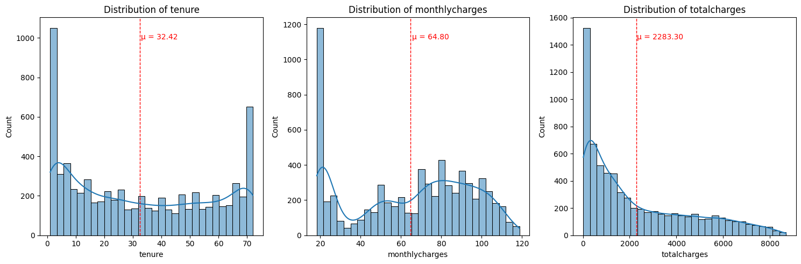

# Laporan Proyek Machine Learning - Gusti Ayu Putu Erika Erlina

### **Domain Proyek:**
Telekomunikasi adalah suatu industri yang mencakup semua perusahaan dan organisasi yang menyediakan layanan komunikasi jarak jauh, termasuk telepon, internet, dan siaran televisi. Pertumbuhan telekomunikasi sangat pesat dari waktu ke waktu sehingga memunculkan berbagai macam perusahaan telekomunikasi. Contohnya saja di Indonesia, berdasarkan capaian PDB dalam kurun waktu empat tahun (sumber BPS 2018), salah satu sektor yang terus bertumbuh paling tinggi di kisaran 8%-10% adalah sektor komunikasi dan informasi. 

Berdasarkan perhitungan nilai CR (*concentration ratio*), industri yang dilakukan pada empat perusahaan telekomunikasi terbesar di Indonesia dengan total keseluruhan 95,26%, tiap perusahaan memiliki pangsa pasar yang bervariasi. Pangsa pasar dalam tiap perusahaan mencerminkan dominasi oleh beberapa pemain utama, persaingan tajam dan kontrol harga yang signifikan, tetapi tetap saling bergantung satu sama lain. Dengan nilai CR4 yang berada di antara 60%-100% dapat mengakibatkan struktur pasar oligopoli yang ketat. Kondisi demikian menyebabkan setiap pengambilan keputusan dari suatu perusahaan dapat memberikan dampak bagi perusahaan lain dan setiap kebijakan harga yang dibuat harus diperhatikan. Contohnya, pada tahun 2017, terjadinya kerugian disebabkan oleh tarif murah yang mengerek jumlah pelanggan secara signifikan, tetapi peningkatan trafik yang melonjak drastis tidak sepadan dengan pendapatan yang diterima. 

#### **Rubrik/Kriteria Tambahan:**
*Churn* adalah suatu kondisi dimana pelanggan tidak melanjutkan menggunakan layanan atau berhenti berlangganan yang disebabkan oleh beberapa hal. Sedangkan pelanggan jangka panjang penting untuk keberlangsungan perusahaan. Kemudian, *churn rate* adalah persentase pelanggan yang berhenti. Tingkat *churn* tinggi mengakibatkan penurunan pangsa pasar dan pendapatan perusahaan. Penyebab *customer churn* bisa disebabkan oleh beberapa faktor seperti pelayanan yang buruk, pindah lokasi, harga, situasi pesaing yang lebih menjanjikan, kecepatan internet, dan sebagainya. Dengan kondisi persaingan industri telekomunikasi yg sangat intens atau kompetitif maka akan meningkatkan persaingan industri di berbagai faktor yang ada demi menjaga retensi atau hubungan *customer* jangka panjang. Dengan demikian, diperlukannya suatu tolak ukur atau indikator untuk mengatur strategi perilaku, bisnis, dan pemasaran yang ada untuk mempertahankan pelanggan serta mengevaluasi situasi dan merancang paket layanan yang sesuai. Oleh karena itu, dibuatlah sebuah model *machine learning* untuk memprediksi apakah seseorang memiliki kecenderungan untuk *churn* atau tidak. Dengan adanya model *machine learning*, diharapkan perusahaan telekomunikasi dapat lebih waspada mengenai pelanggan-pelanggan yang berpotensi untuk *churn* untuk mempertahankan pelanggan yang sudah ada.

**Referensi:**
* [Analisis Industri Telekomunikasi Seluler di Indonesia Pendekatan SCP Structure Conduct Performance](https://www.researchgate.net/publication/348609455_Analisis_Industri_Telekomunikasi_Seluler_di_Indonesia_Pendekatan_SCP_Structure_Conduct_Perfoemance)
* [Telecom Customer Churn Prediction Analysis](https://www.researchgate.net/publication/376829074_Telecom_Customer_Churn_Prediction_Analysis)
* [Factors Influence Customer Churn on Internet Service Providers in Indonesia](https://e-journal.unair.ac.id/TIJAB)

### **Business Understanding:**
Berdasarkan latar belakang, berikut ini adalah rumusan masalah yang dapat diselesaikan:

**Problem Statements**:
* Bagaimana proses analisis EDA dapat membantu dalam memahami distribusi masing-masing fitur, hubungan antar fitur, serta interaksi kompleks antara beberapa fitur untuk mengidentifikasi pola yang mungkin mempengaruhi prediksi churn pelanggan? 
* Bagaimana cara mengidentifikasi layanan-layanan yang paling berpengaruh terhadap kecenderungan pelanggan untuk churn, sehingga perusahaan dapat mengoptimalkan strategi retention?
* Bagaimana memperoleh model machine learning yang sesuai dengan kebutuhan industri telekomunikasi dan dapat memberikan insight yang relevan bagi keputusan bisnis?

**Goals**:
* Mendapatkan wawasan yang lebih dalam tentang pola dan hubungan antar fitur dalam data.
* Mengidentifikasi layanan-layanan yang paling berpengaruh terhadap kecenderungan churn pelanggan, dengan fokus pada perbaikan dan pengoptimalan layanan tersebut untuk meningkatkan kepuasan dan retensi pelanggan.
* Mengembangkan model machine learning yang tepat guna untuk mengatasi masalah churn pelanggan di industri telekomunikasi, yang dapat memberikan prediksi yang akurat serta menyediakan wawasan yang dapat membantu perusahaan dalam merumuskan strategi bisnis yang lebih efektif.

**Solution Statements**:
* Untuk memahami distribusi dan hubungan antar fitur, dilakukan analisis univariate untuk mengevaluasi distribusi tiap fitur, bivariate untuk memahami hubungan antar dua fitur, dan multivariate untuk melihat interaksi yang lebih kompleks antar banyak fitur. 

* Untuk mengidentifikasi layanan yang paling berpengaruh terhadap churn pelanggan, digunakan uji independensi chi-squared untuk data kategorik (misalnya, jenis layanan) dan uji ANOVA untuk data numerik (misalnya, total tagihan atau durasi layanan). Uji-uji ini memungkinkan identifikasi fitur-fitur yang memiliki hubungan signifikan dengan kecenderungan churn pelanggan, yang kemudian dapat digunakan untuk strategi retention.
* Penggunaan dua algoritma seperti XGBoost dan LightGBM untuk menemukan model yang sesuai dan mampu mengatasi masalah imbalanced classification binary serta memberikan performa yang baik dalam waktu yang relatif cepat.
     * Cara kerja XGBoost (Extreme Gradient Boosting):
          * Menggunakan teknik boosting, di mana model dibangun secara bertahap untuk memperbaiki kesalahan model sebelumnya.
          * Menerapkan regularisasi untuk menghindari overfitting dan memastikan generalisasi yang baik.
          * Menggunakan decision tree sebagai dasar model, namun dengan pendekatan yang lebih canggih untuk mengoptimalkan hasil.

     * Cara kerja LightGBM (Light Gradient Boosting Machine):
          * Menggunakan teknik leaf-wise growth pada pohon keputusan, yang memungkinkan pembelajaran lebih efisien.
          * Melakukan pembagian data secara histogram untuk mempercepat komputasi dan mengurangi penggunaan memori.
          * Menerapkan regularisasi untuk meningkatkan kemampuan generalisasi dan menghindari overfitting.

### **Data Understanding:**
Dataset yang digunakan berisi **7043** baris dan **21** kolom, dengan komposisi tipe data yang dominan berupa **18 kolom bertipe object**, **2 kolom bertipe int64**, dan **1 kolom bertipe float64**. Fitur numerik yang ada antara lain `SeniorCitizen`, `tenure`, dan `MonthlyCharges`, sementara fitur kategorikal mencakup `Partner`, `gender`, dan lainnya. Kolom `customerID` memiliki nilai unik terbanyak, sedangkan data lainnya memiliki antara 2 hingga 4 nilai unik. Kolom `TotalCharges` memiliki tipe data yang tidak sesuai dan perlu diubah tipe datanya agar dapat diproses lebih lanjut. Tidak ditemukan missing values atau data duplikat dalam dataset ini, tetapi terdapat ketidakseimbangan data pada kolom target (churn), dengan jumlah churn "No" sebanyak 5174 dan churn "Yes" sebanyak 1869.

**Sumber data:** [IBM Telco Churn Repository](https://github.com/IBM/telco-customer-churn-on-icp4d/tree/master/data)

**Variabel-variabel pada IBM Telco Churn dataset adalah sebagai berikut:**

| **Column Name**       | **Description**                                                              | **Possible Values**                                                                                           |
|-----------------------|------------------------------------------------------------------------------|---------------------------------------------------------------------------------------------------------------|
| **customerID**         | ID Pelanggan                                                                  | Unique identifier for each customer                                                                            |
| **gender**             | Jenis kelamin pelanggan                                                       | male, female                                                                                                  |
| **SeniorCitizen**      | Apakah pelanggan merupakan warga senior atau bukan                           | 1, 0                                                                                                          |
| **Partner**            | Apakah pelanggan memiliki pasangan atau tidak                                | Yes, No                                                                                                       |
| **Dependents**         | Apakah pelanggan memiliki tanggungan atau tidak                               | Yes, No                                                                                                       |
| **tenure**             | Jumlah bulan pelanggan telah berlangganan dengan perusahaan                  | Integer value (0-72 months)                                                                                   |
| **PhoneService**       | Apakah pelanggan memiliki layanan telepon atau tidak                         | Yes, No                                                                                                       |
| **MultipleLines**      | Apakah pelanggan memiliki beberapa saluran telepon atau tidak                | Yes, No, No phone service                                                                                     |
| **InternetService**    | Penyedia layanan internet pelanggan                                           | DSL, Fiber Optic, No                                                                                          |
| **OnlineSecurity**     | Apakah pelanggan memiliki keamanan online atau tidak                         | Yes, No, No phone service                                                                                     |
| **OnlineBackup**       | Apakah pelanggan memiliki cadangan online atau tidak                         | Yes, No, No internet service                                                                                  |
| **DeviceProtection**   | Apakah pelanggan memiliki perlindungan perangkat atau tidak                  | Yes, No, No internet service                                                                                  |
| **TechSupport**        | Apakah pelanggan memiliki dukungan teknis atau tidak                         | Yes, No, No internet service                                                                                  |
| **StreamingTV**        | Apakah pelanggan memiliki layanan TV streaming atau tidak                    | Yes, No, No internet service                                                                                  |
| **StreamingMovies**    | Apakah pelanggan memiliki layanan film streaming atau tidak                  | Yes, No, No internet service                                                                                  |
| **Contract**           | Jenis kontrak pelanggan                                                       | Month-to-month, One year, Two year                                                                            |
| **PaperlessBilling**   | Apakah pelanggan menggunakan penagihan tanpa kertas atau tidak               | Yes, No                                                                                                       |
| **PaymentMethod**      | Metode pembayaran pelanggan                                                  | Electronic check, Mailed check, Bank transfer (automatic), Credit card (automatic)                           |
| **MonthlyCharges**     | Jumlah yang dibebankan kepada pelanggan setiap bulan                         | Numeric value                                                                                                 |
| **TotalCharges**       | Jumlah total yang dibebankan kepada pelanggan                                | Numeric value                                                                                                 |
| **Churn**              | Apakah pelanggan berhenti berlangganan atau tidak                            | Yes, No                                                                                                       |
---

**Tahapan Memahami Data:**

* Melakukan univariate analysis data kategorik untuk mengevaluasi distribusi tiap fitur.

* Melakukan univariate analysis data numerik untuk mengetahui distribusi, skewness, dan outlier dalam data.

* Melakukan bivariate analysis data kategorik dengan target untuk memahami hubungan antar dua fitur.

* Melakukan bivariate analysis data numerik dengan target untuk memahami hubungan antar dua fitur.

* Melakukan multivariate analysis untuk melihat interaksi yang lebih kompleks antar banyak fitur:

### **Data Preparation:**
* Feature selection
* Categorical encoding
* Merge data and drop unselected features
* Data balancing 
(jelasin proses dan alasan perlu)

### **Modeling:**
* Menjelaskan tahapan dan parameter yang digunakan pada proses pemodelan.

* Kelebihan XGBoost:
     * XGBoost efektif dalam menangani masalah data tidak seimbang dengan memberikan bobot lebih pada kelas minoritas.
     * XGBoost menggunakan teknik paralelisasi dan optimisasi yang memungkinkan model ini lebih cepat dan efisien dibandingkan dengan algoritma lain.
     * XGBoost dilengkapi dengan regularisasi untuk mengurangi overfitting, sehingga model lebih generalisasi dan tahan terhadap noise dalam data.

* Kelebihan LightGBM:
     * Lebih cepat dalam melatih model dibandingkan dengan algoritma lainnya, seperti XGBoost.
     * Memiliki penggunaan memori yang lebih efisien.
     * Dapat menangani data besar dan kategori dengan lebih baik.

* pilih model terbaik + jelaskan

### **Evaluation:**
* Menyebutkan metrik evaluasi yang digunakan.
* Menjelaskan hasil proyek berdasarkan metrik evaluasi.
* menjelaskan formula metrik dan bagaimana metrik tersebut bekerja.