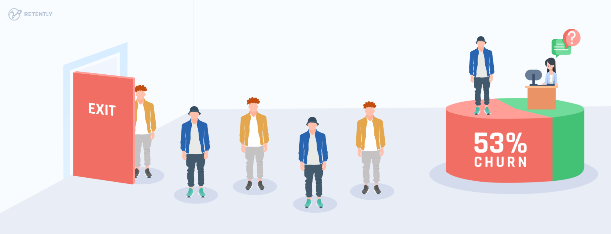
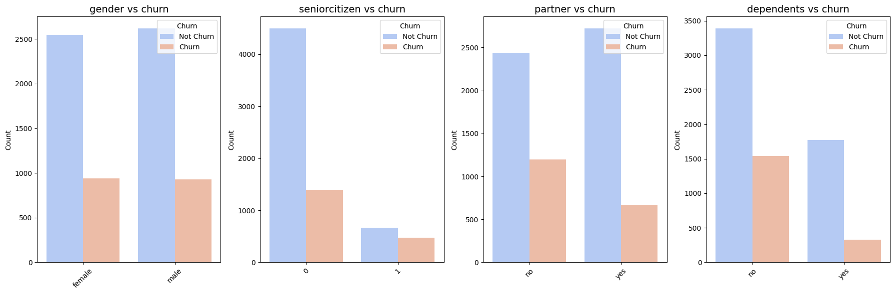
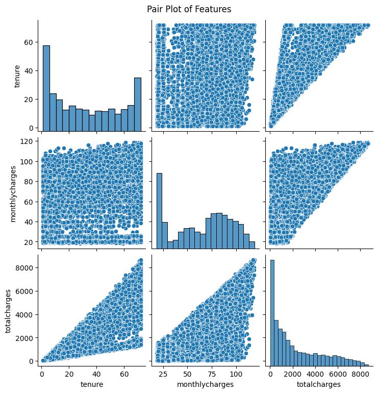
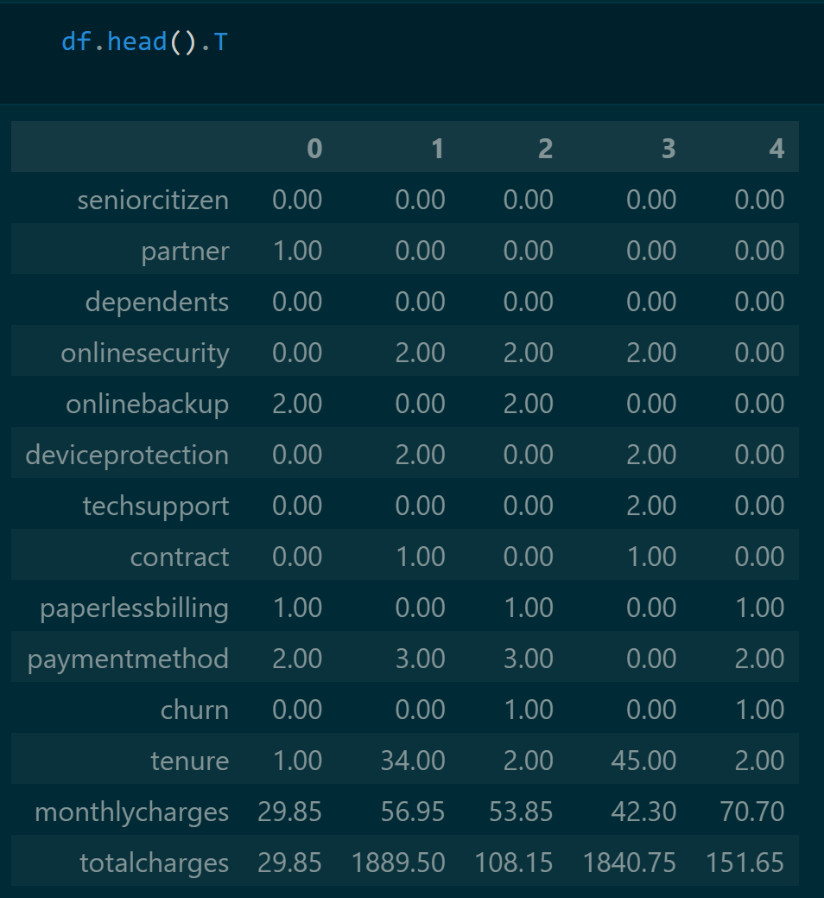
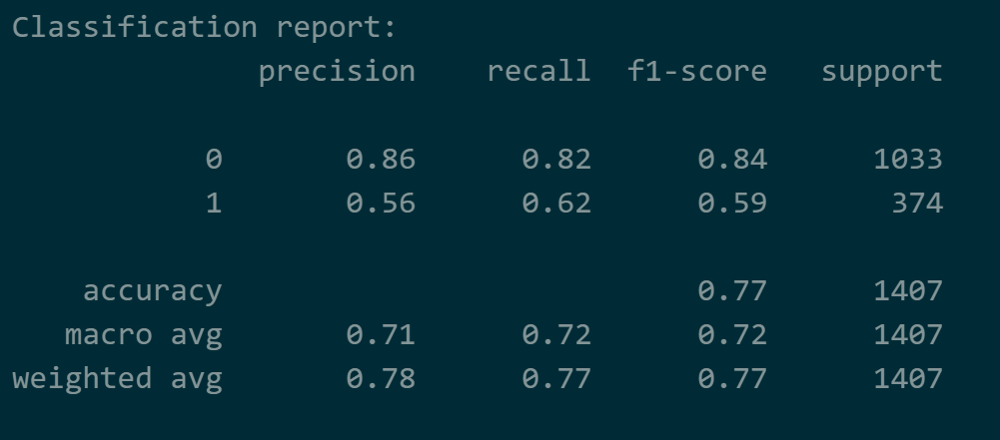

# Laporan Proyek Machine Learning - Gusti Ayu Putu Erika Erlina



### **Domain Proyek:**
Telekomunikasi adalah suatu industri yang mencakup semua perusahaan dan organisasi yang menyediakan layanan komunikasi jarak jauh, termasuk telepon, internet, dan siaran televisi. Pertumbuhan telekomunikasi sangat pesat dari waktu ke waktu sehingga memunculkan berbagai macam perusahaan telekomunikasi. Contohnya saja di Indonesia, berdasarkan capaian PDB dalam kurun waktu empat tahun (sumber BPS 2018), salah satu sektor yang terus bertumbuh paling tinggi di kisaran 8%-10% adalah sektor komunikasi dan informasi. 

Berdasarkan perhitungan nilai CR (*concentration ratio*), industri yang dilakukan pada empat perusahaan telekomunikasi terbesar di Indonesia dengan total keseluruhan 95,26%, tiap perusahaan memiliki pangsa pasar yang bervariasi. Pangsa pasar dalam tiap perusahaan mencerminkan dominasi oleh beberapa pemain utama, persaingan tajam dan kontrol harga yang signifikan, tetapi tetap saling bergantung satu sama lain. Dengan nilai CR4 yang berada di antara 60%-100% dapat mengakibatkan struktur pasar oligopoli yang ketat. Kondisi demikian menyebabkan setiap pengambilan keputusan dari suatu perusahaan dapat memberikan dampak bagi perusahaan lain dan setiap kebijakan harga yang dibuat harus diperhatikan. Contohnya, pada tahun 2017, terjadinya kerugian disebabkan oleh tarif murah yang mengerek jumlah pelanggan secara signifikan, tetapi peningkatan trafik yang melonjak drastis tidak sepadan dengan pendapatan yang diterima. 

*Churn* terjadi ketika pelanggan berhenti menggunakan layanan atau tidak memperpanjang langganannya, yang dapat disebabkan oleh berbagai faktor seperti kualitas layanan, harga, persaingan, atau perubahan kebutuhan. Pelanggan jangka panjang sangat berharga bagi keberlangsungan perusahaan, sehingga *churn rate*—persentase pelanggan yang berhenti—menjadi metrik penting dalam menilai stabilitas bisnis. Tingginya tingkat *churn* dapat menyebabkan penurunan pangsa pasar dan pendapatan, terutama dalam industri telekomunikasi yang sangat kompetitif. Oleh karena itu, perusahaan perlu mengidentifikasi penyebab utama dan memprediksi *churn* serta merancang strategi untuk meningkatkan retensi pelanggan. Salah satu solusi yang efektif adalah membangun model *machine learning* untuk memprediksi pelanggan yang berpotensi *churn*. Dengan model ini, perusahaan dapat mengambil langkah proaktif, seperti menawarkan insentif atau meningkatkan layanan, guna mempertahankan pelanggan dan meningkatkan loyalitas mereka.

**Referensi:**
* [Analisis Industri Telekomunikasi Seluler di Indonesia Pendekatan SCP Structure Conduct Performance](https://www.researchgate.net/publication/348609455_Analisis_Industri_Telekomunikasi_Seluler_di_Indonesia_Pendekatan_SCP_Structure_Conduct_Perfoemance)
* [Telecom Customer Churn Prediction Analysis](https://www.researchgate.net/publication/376829074_Telecom_Customer_Churn_Prediction_Analysis)
* [Factors Influence Customer Churn on Internet Service Providers in Indonesia](https://e-journal.unair.ac.id/TIJAB)

### **Business Understanding:**
Berdasarkan latar belakang, berikut ini adalah rumusan masalah yang dapat diselesaikan:

**Problem Statements**:
* Bagaimana proses analisis EDA dapat membantu dalam memahami distribusi masing-masing fitur, hubungan serta interaksi kompleks antara beberapa fitur untuk mengidentifikasi layanan yang mungkin mempengaruhi tingkat churn pelanggan? 
* Bagaimana cara mengidentifikasi layanan-layanan yang paling berpengaruh terhadap kecenderungan pelanggan untuk churn, sehingga perusahaan dapat mengoptimalkan strategi retention?
* Bagaimana memperoleh model machine learning yang sesuai dengan kebutuhan industri telekomunikasi dan dapat memberikan insight yang relevan bagi keputusan bisnis?

**Goals**:
* Mendapatkan wawasan yang lebih dalam tentang pola dan hubungan antar fitur dalam data.
* Mengidentifikasi layanan-layanan yang paling berpengaruh terhadap kecenderungan churn pelanggan, dengan fokus pada perbaikan dan pengoptimalan layanan tersebut untuk meningkatkan kepuasan dan retensi pelanggan.
* Mengembangkan model machine learning yang tepat guna untuk mengatasi masalah churn pelanggan di industri telekomunikasi, yang dapat memberikan prediksi serta menyediakan wawasan yang dapat membantu perusahaan dalam merumuskan strategi bisnis yang lebih efektif.

**Solution Statements**:
* Untuk memahami distribusi dan hubungan antar fitur, dilakukan analisis univariate untuk mengevaluasi distribusi tiap fitur, bivariate untuk memahami hubungan antar dua fitur, dan multivariate untuk melihat interaksi yang lebih kompleks antar banyak fitur. 
* Untuk mengidentifikasi layanan yang paling berpengaruh terhadap churn pelanggan, digunakan uji independensi chi-square untuk data kategorik (misalnya, jenis layanan) dan uji ANOVA untuk data numerik (misalnya, total tagihan atau durasi berlangganan). Uji-uji ini memungkinkan identifikasi fitur-fitur yang memiliki hubungan signifikan dengan kecenderungan churn pelanggan, yang kemudian dapat digunakan untuk strategi retention.
* Penggunaan dua algoritma seperti XGBoost dan LightGBM untuk menemukan model yang sesuai dan mampu mengatasi masalah imbalanced classification binary serta memberikan performa yang baik dalam waktu yang relatif cepat.


### **Data Understanding:**
Dataset yang digunakan berisi **7043** baris dan **21** kolom, dengan komposisi tipe data yang dominan berupa **18 kolom bertipe object**, **2 kolom bertipe int64**, dan **1 kolom bertipe float64**. Fitur numerik yang ada antara lain `SeniorCitizen`, `tenure`, dan `MonthlyCharges`, sementara fitur kategorikal mencakup `Partner`, `gender`, dan lainnya. Kolom `customerID` memiliki nilai unik terbanyak, sedangkan data lainnya memiliki antara 2 hingga 4 nilai unik. Kolom `TotalCharges` memiliki tipe data yang tidak sesuai dan perlu diubah tipe datanya agar dapat diproses lebih lanjut. Tidak ditemukan missing values atau data duplikat dalam dataset ini, tetapi terdapat ketidakseimbangan data pada kolom target (churn), dengan jumlah churn `No` sebanyak `5174` dan churn `Yes` sebanyak `1869`.

**Sumber Data:** [IBM Telco Churn Repository](https://github.com/IBM/telco-customer-churn-on-icp4d/tree/master/data)

<p align="center">
  <strong>Variabel-Variabel Pada IBM Telco Churn Dataset</strong>
</p>

---
| **Column Name**       | **Description**                                                              | **Values**                                                                                           |
|-----------------------|------------------------------------------------------------------------------|---------------------------------------------------------------------------------------------------------------|
| **customerID**         | ID Pelanggan                                                                  | Unique identifier for each customer                                                                            |
| **gender**             | Jenis kelamin pelanggan                                                       | male, female                                                                                                  |
| **SeniorCitizen**      | Apakah pelanggan merupakan warga senior atau bukan                           | 1, 0                                                                                                          |
| **Partner**            | Apakah pelanggan memiliki pasangan atau tidak                                | Yes, No                                                                                                       |
| **Dependents**         | Apakah pelanggan memiliki tanggungan atau tidak                               | Yes, No                                                                                                       |
| **tenure**             | Jumlah bulan pelanggan telah berlangganan dengan perusahaan                  | Integer value (0-72 months)                                                                                   |
| **PhoneService**       | Apakah pelanggan memiliki layanan telepon atau tidak                         | Yes, No                                                                                                       |
| **MultipleLines**      | Apakah pelanggan memiliki beberapa saluran telepon atau tidak                | Yes, No, No phone service                                                                                     |
| **InternetService**    | Penyedia layanan internet pelanggan                                           | DSL, Fiber Optic, No                                                                                          |
| **OnlineSecurity**     | Apakah pelanggan memiliki keamanan online atau tidak                         | Yes, No, No phone service                                                                                     |
| **OnlineBackup**       | Apakah pelanggan memiliki cadangan online atau tidak                         | Yes, No, No internet service                                                                                  |
| **DeviceProtection**   | Apakah pelanggan memiliki perlindungan perangkat atau tidak                  | Yes, No, No internet service                                                                                  |
| **TechSupport**        | Apakah pelanggan memiliki dukungan teknis atau tidak                         | Yes, No, No internet service                                                                                  |
| **StreamingTV**        | Apakah pelanggan memiliki layanan TV streaming atau tidak                    | Yes, No, No internet service                                                                                  |
| **StreamingMovies**    | Apakah pelanggan memiliki layanan film streaming atau tidak                  | Yes, No, No internet service                                                                                  |
| **Contract**           | Jenis kontrak pelanggan                                                       | Month-to-month, One year, Two year                                                                            |
| **PaperlessBilling**   | Apakah pelanggan menggunakan penagihan tanpa kertas atau tidak               | Yes, No                                                                                                       |
| **PaymentMethod**      | Metode pembayaran pelanggan                                                  | Electronic check, Mailed check, Bank transfer (automatic), Credit card (automatic)                           |
| **MonthlyCharges**     | Jumlah yang dibebankan kepada pelanggan setiap bulan                         | Numeric value                                                                                                 |
| **TotalCharges**       | Jumlah total yang dibebankan kepada pelanggan                                | Numeric value                                                                                                 |
| **Churn**              | Apakah pelanggan berhenti berlangganan atau tidak                            | Yes, No                                                                                                       |
---


#### **Tahapan Memahami Data:**


* Melakukan univariate analysis pada data kategorik untuk mengevaluasi distribusi tiap fitur.

     
     Mayoritas pelanggan adalah non-lansia, tidak memiliki tanggungan, dan lebih memilih layanan telepon serta internet fiber optic, tetapi jarang berlangganan layanan tambahan. Dalam sistem pembayaran, pelanggan cenderung memilih kontrak bulanan, penagihan tanpa kertas, dan metode pembayaran electronic check, sementara tingkat churn didominasi oleh pelanggan yang masih bertahan atau berlangganan.


* Melakukan univariate analysis pada data numerik untuk mengetahui distribusi, skewness, dan outlier dalam data.

     
     **Insights**:
     * Tidak ada kolom yang berdistribusi normal atau simetris.
     * `tenure` distribusinya nyaris seperti distribusi U (U-shaped distribution) dan distribusinya terbagi menjadi 2 populasi dengan perilaku berbeda, seperti pola awal didominasi pelanggan baru dan pola akhir diisi oleh pelanggan yang loyal dan jarang ada nilai di tengah, mean-nya juga nyaris mendekati median.
     * `monthlycharges` menunjukkan distribusi yang sangat bervariasi dan terlihat data terkonsentrasi di sekitar `$70` sampai `$90`.
     * `totalcharges` terlihat seperti distribusi log-normal atau positively skewed (right-skewed) dimana mean > median dan mayoritas datanya terdapat di sekitar `$0 - $100`, semakin kecil di bagian kanan (tail) mengindikasikan harga yang semakin mahal dan hal ini logis karena semakin mahal harganya maka belum tentu semua orang sanggup.
     * Nilai besar di ekor (tail) distribusi right-skewed tetap perlu diperhatikan karena bisa saja memengaruhi model.
     * Transformasi data atau scaling bisa menjadi solusi untuk mengurangi dampak distribusi yang tidak seimbang.

     
     
     **Insights**:
     * Data `totalcharges` memiliki rentang yang sangat besar yaitu dengan `min = 18.8` dan `max = 8684.8`, dengan kuartil 1 `(Q1) = 401.45`, `Q2 = 1397.475`, dan `Q3 = 3794.7375` menunjukkan selisih antar kuartil cukup besar.
     * Mengingat selisihnya yang besar dan Q3 cukup tinggi yaitu 3794.74, membuat kemungkinan bahwa nilai `max = 8684.8` bukanlah outlier karena batas deteksi outlier di atas `Q3 + 1.5 x IQR` bisa sangat jauh sehingga nilai disekitar max masih ada di dalam rentang.

     
     **Insight**:
     * Tidak ada outlier di semua data numerik dalam dataset telco churn.
     

* Melakukan bivariate analysis pada data kategorik dengan target untuk memahami hubungan antar dua variabel.

     
     **Insights**:
     * `gender` -> Pada gender female perbedaan pelanggan yang churn dan tidak churn sangat signifikan dan hal yang sama terjadi pada gender male juga. Namun, jika kedua gender dibandingkan outputnya terlihat cukup mirip atau sama.
     * `seniorcitizen` -> Terdapat perbedaan signifikan antara pelanggan yang churn dan tidak churn pada kelompok pelanggan yang bukan lansia atau `0`, di mana pelanggan yang tidak churn cenderung lebih dominan. Sebaliknya, pada kelompok pelanggan lansia, pola yang berbeda terlihat, di mana jumlah pelanggan yang churn melebihi 50% dari pelanggan lansia yang tidak churn.
     * `partner` -> Jika hanya membandingkan jumlah pelanggan churn-nya saja, terlihat bahwa pelanggan yang tidak memiliki pasangan kecenderungan untuk churn-nya jauh lebih tinggi dibandingkan pelanggan yang memiliki pasangan padahal pelanggan yang memiliki pasangan jumlahnya lebih banyak.
     * `dependents` -> Jika hanya membandingkan jumlah pelanggan churn-nya, terlihat bahwa pelanggan yang tidak memiliki tanggungan memiliki kecenderungan untuk churn lebih tinggi dibandingkan pelanggan yang memiliki tanggungan.

     
     **Insights**:
     * `phoneservice` -> Ketika berfokus pada pelanggan yang churn saja, terlihat bahwa pelanggan yang berlangganan pada layanan phoneservice lebih banyak memiliki kecenderungan untuk churn dibandingkan pelanggan yang tidak berlangganan. Hal ini bisa menjadi indikator akan adanya ketidakpuasan akan layanan phoneservice yang diberikan.
     * `multiplelines` -> Pada multiplelines pelanggan yang hanya berlangganan pada satu saluran atau di kelompok `no` dan berlangganan dengan multiplelines (kelompok `yes`) memiliki jumlah churn yang sama. Ini bisa menjadi indikasi bahwa adanya ketidakpuasan akan layanan yang diberikan.
     * `internetservice` -> Jumlah pelanggan churn di kelompok fiber optic telah melebihi 50% dari jumlah pelanggan yang tidak churn di kelompok tersebut, hal ini bisa mengindikasikan ada yang salah sehingga mempengaruhi kepuasan pelanggan dan perlu dioptimalisasi.
     * `onlinesecurity` -> Pada layanan add-on atau tambahan ini, jumlah pelanggan churn pada kelompok tidak berlangganan telah melebihi 50% dari pelanggan yang tidak churn di kelompok ini. Hal ini mengindikasikan jika pelanggan tidak berlangganan pada layanan tambahan maka memiliki tendensi untuk churn.

     
     **Insights**:
     * `onlinebackup`, `deviceprotection`, `techsupport` -> Jumlah pelanggan yang churn pada kelompok tidak berlangganan atau `no` lebih banyak dan melebihi 50% dari pelanggan yang tidak churn di kelompok ini, ini mengindikasikan jika pelanggan tidak berlangganan pada layanan tambahan yang tertera maka memiliki kecenderungan churn lebih tinggi.
     * `streamingtv` -> Pelanggan yang churn di kelompok tidak berlangganan dan berlangganan layanan ini jumlahnya mirip atau perbedaan antar pelanggan yang churn di kelompok `no` dan `yes` tidak signifikan.

     
     **Insights**:
     * `streamingmovies` -> Pada kelompok tidak berlangganan atau `no` terlihat bahwa churn jumlahnya memenuhi 50% dari pelanggan yang tidak churn. Kemudian, pada kelompok `yes` pelanggan memiliki kecenderungan churn yang cukup tinggi juga. Ini mengindikasikan adanya ketidakpuasan atas layanan yang diberikan.
     * `contract` -> Pelanggan pada kelompok `month-to-month` memiliki kecenderungan yang lebih tinggi untuk churn dan itu ditunjukkan dengan bar chart yang jumlahnya melebihi 50% dari jumlah pelanggan yang tidak churn.
     * `paperlessbilling` -> Pelanggan pada kelompok `yes` memiliki kecenderungan churn jauh lebih banyak daripada kelompok `no`, ini bisa menjadi indikator adanya ketidakpuasan pelanggan atas layanan yang diberikan.
     * `paymentmethod` -> Terlihat pelanggan yang churn mendominasi kelompok `electornic check` yang mengindikasikan adanya ketidakpuasan layanan pembayaran dengan metode ini.

     **Conclusion:**
     Pelanggan dengan kontrak bulanan, penagihan tanpa kertas, dan metode pembayaran electronic check menunjukkan kecenderungan churn yang lebih tinggi, mengindikasikan potensi ketidakpuasan terhadap layanan pembayaran dan fleksibilitas kontrak. Selain itu, pelanggan yang tidak memiliki pasangan, tidak berlangganan layanan tambahan seperti online security atau tech support, serta pengguna fiber optic cenderung lebih sering churn, menunjukkan adanya faktor kepuasan yang perlu dievaluasi. Kesamaan pola churn antara pelanggan dengan satu atau beberapa saluran telepon, serta antara pengguna layanan streaming TV dan movies, mengindikasikan bahwa kualitas layanan bisa menjadi faktor utama dalam keputusan churn.

* Melakukan bivariate analysis pada data numerik dengan target untuk memahami hubungan antar dua fitur.

     
     **Insight:**
     * Pelanggan yang churn cenderung memiliki masa berlangganan lebih pendek (rata-rata 9 bulan) dan tagihan bulanan lebih tinggi ($80) dibandingkan pelanggan yang tidak churn, yaitu memiliki rata-rata masa berlangganan 37 bulan dan tagihan $63. Selain itu, total tagihan pelanggan yang churn lebih rendah (sekitar $600) dibandingkan yang tidak churn ($1700), menunjukkan bahwa pelanggan churn umumnya meninggalkan layanan lebih awal sebelum akumulasi tagihan menjadi besar.

* Melakukan multivariate analysis untuk melihat interaksi yang lebih kompleks antar banyak fitur:

     
     **Insight:**
     * Heatmap menunjukkan adanya korelasi antar beberapa fitur. Dimana semakin lama pelanggan berlangganan, semakin rendah kecenderungannya untuk churn, ini menggambarkan hubungan negatif yang kuat antara durasi berlangganan dan churn. Di sisi lain, durasi berlangganan yang lebih lama juga terkait dengan nilai kontrak atau lamanya waktu kontrak yang lebih tinggi, menunjukkan hubungan positif antara keduanya. Selain itu, pelanggan yang memilih layanan tambahan atau add-on juga cenderung memiliki durasi berlangganan yang lebih lama, mengindikasikan bahwa keputusan untuk menambah layanan akan mempengaruhi hubungan jangka panjang dengan perusahaan.
     
     

     **Insight:**
     * Dari pair plot terlihat peningkatan masa berlangganan atau tagihan bulanan cenderung meningkatkan total tagihan. Pola segitiga yang terlihat di scatter plot kemungkinan disebabkan oleh distribusi data yang tidak normal dan tingkat variasi data yang tinggi, yang menyebabkan penyebaran data tidak merata.

### **Data Preparation:**

* **Assesing Data**

     Pada tahap assessing data, dilakukan analisis untuk memahami struktur dan kualitas data. Pertama, summary statistics memberikan wawasan mengenai distribusi dan karakteristik data, seperti rata-rata `tenure` yang menunjukkan ketidakpuasan pelanggan, serta variasi harga `MonthlyCharges` yang menunjukkan perbedaan signifikan antar pelanggan. Selain itu, proses ini mengidentifikasi masalah seperti tipe data yang salah pada kolom `TotalCharges` dan ketidaksesuaian kolom `customerID` untuk modeling. Tahapan ini diperlukan untuk mendeteksi missing values, duplikasi, dan inkonsistensi, serta untuk mempersiapkan data agar lebih siap digunakan dalam analisis lebih lanjut dan pemodelan yang lebih akurat.

* **Data Cleaning**
     1. **Column Renaming:** Setelah tahap assesing data dan memperhatikan semua nama kolom, terdapat penamaan kolom yang tidak konsisten sehingga perlu diubah agar konsisten dan sesuai standar. Prosesnya dengan memilih semua kolom yang ada lalu dibuat lowercase.
          ```python
          df.columns = df.columns.str.lower()
          ```
     2. **Convert Data Type and Convert Text to Lowercase:** Setelah dilakukan assesing data, terlihat data dalam setiap baris memiliki format penulisan yang tidak konsisten. Kode berikut, bertujuan untuk mengonversi semua nilai dalam kolom kategorikal menjadi huruf kecil (lowercase) guna menjaga konsistensi data dan menghindari perbedaan akibat huruf kapital. Prosesnya memilih kolom yang bertipe object kemudian dibuat lowercase.
          ```python
          # convert data type
          categorical_columns = list(df.columns[df.dtypes == 'object'])
          # membuat lower case
          for col in categorical_columns:
               df[col] = df[col].str.lower()
          ```
     3. **Correcting Data Type:** Saat tahap assesing data terlihat tipe data yang tidak sesuai maka diperlukan tahap konversi tipe data dalam setiap kolom di dataset. Langkah ini penting dalam preprocessing agar data lebih efisien, akurat, dan siap untuk dianalisis atau dimodelkan.
          ```python
          # convert ke tipe data category
          df.seniorcitizen = df.seniorcitizen.astype('category')

          # convert ke tipe data numerik
          df.totalcharges = pd.to_numeric(df.totalcharges, errors='coerce')
          ```
     4. **Handling Missing Values:** Prosesnya adalah, setelah mengonversi tipe data `totalcharges` menjadi numerik dengan penggunaan parameter `errors='coerce'` maka ada kemungkinan munculnya nilai `NaN` pada data yang sebelumnya tidak dapat dikonversi. Oleh karena itu, penting untuk menangani missing values ini agar data yang digunakan dalam analisis dan pemodelan tidak terpengaruh oleh ketidakhadiran informasi yang dapat mengganggu hasil.
          ```python
          # drop missing values
          df = df.dropna(subset=['totalcharges'])
          ```
     5. **Drop Column:** Proses ini dilakukan dengan mengetikkan kode seperti di bawah ini. Tahapan ini diperlukan untuk menghapus kolom yang tidak digunakan dalam analisis eksploratori (EDA) agar tidak mengganggu proses visualisasi data.
          ```python
          # drop kolom 
          df = df.drop(columns='customerid', axis=1)
          ```

* **Exploratory Data Analysis (EDA)**

     Prosesnya data dieksplorasi melalui statistik deskriptif, analisis distribusi, identifikasi missing values, dan pemeriksaan duplikasi untuk memahami karakteristik dan kualitas data. Tahap ini diperlukan karena membantu mengidentifikasi pola, hubungan, dan potensi masalah dalam data sebelum dilakukan pemodelan. Proses ini juga penting untuk mempersiapkan data agar lebih bersih, konsisten, dan siap untuk analisis lebih lanjut.
     Untuk lebih jelasnya, silakan merujuk ke bagian [Tahapan Memahami Data](#tahapan-memahami-data).


* **Categorical Encoding**
     ```python
     # encoding data kategorik
     df_categoric = df[categorical_columns].copy()

    for col in categorical_columns:
          le = LabelEncoder()
          df_categoric[col] = le.fit_transform(df_categoric[col])
     ```
     Prosesnya adalah memilih kolom-kolom yang memiliki data kategorik. Lalu dilakukanlah label encoding, label encoding dipilih daripada one-hot encoding karena dataset memiliki banyak fitur dan jumlah kategori terbanyak adalah empat. Sehingga dapat menghindari peningkatan dimensi yang berlebihan. Selain itu, label encoding lebih efisien dalam komputasi dan memori, serta tidak memengaruhi performa model karena algoritma yang digunakan tidak sensitif terhadap skala atau urutan numerik.

* **Feature Selection**
     ```python
     from sklearn.feature_selection import SelectKBest, chi2, f_classif

     # uji independensi chi2
     bestfeatures = SelectKBest(score_func=chi2, k=10)

     # uji ANOVA F-value
     bestfeatures = SelectKBest(score_func=f_classif, k=3)
     ```
     **Hasil uji independensi chi2:**

     

     **Hasil uji ANOVA F-value:**

     

     Feature selection dilakukan untuk memilih fitur yang paling relevan dan prosesnya dilakukan menggunakan class `SelectKBest` dari scikit-learn. Uji chi-square digunakan untuk mengukur hubungan antara fitur kategorikal dengan target dimana sebelumnya data-data kategorik telah diubah menjadi label dengan label encoding, sementara ANOVA F-value digunakan untuk menilai kontribusi fitur numerik terhadap target.
     
     Dari hasil uji chi-square, dipilih 10 fitur yang memiliki hubungan kuat dengan churn, sedangkan fitur numerik seperti `tenure` terbukti memiliki korelasi yang signifikan berdasarkan ANOVA. Tahapan ini diperlukan agar model dapat bekerja lebih optimal dengan hanya menggunakan fitur yang paling berpengaruh, mengurangi dimensi data, dan meningkatkan efisiensi pemrosesan.

* **Merge data and Drop Unselected Features**
     ```python
     # membuat dataframe dengan features yang dipilih
     df = pd.concat([df_categoric, df_numeric], axis=1)
     df.drop(columns = columns_to_drop, axis=1, inplace=True)
     ```
     **Fitur terpilih terdapat 13 kolom dari yang awalnya 20 kolom**
     
     

     Prosesnya diawali dengan data kategorik yang telah di-encoding menggunakan label encoding digabungkan dengan data numerik ke dalam satu dataframe. Setelah penggabungan, hanya fitur-fitur yang telah dipilih melalui uji chi-square dan ANOVA yang dipertahankan, sementara fitur yang tidak relevan dihapus. Langkah ini bertujuan untuk memastikan bahwa hanya fitur yang memiliki hubungan kuat dengan target yang digunakan dalam proses modeling. Dengan mengurangi fitur yang tidak diperlukan, kompleksitas model dapat dikurangi sehingga meningkatkan efisiensi komputasi. Selain itu, eliminasi fitur yang tidak relevan membantu menghindari overfitting dan meningkatkan generalisasi model terhadap data baru.

* **Train Test Split Data**
     ```python
     # splitting training dan testing data
     X_train, X_test, y_train, y_test = train_test_split(X, y, test_size=0.2, random_state=42)
     ```
     **Hasilnya:**

     

     Setelah memisahkan features (X) dan target (y) dalam dataset. Dataset dibagi menjadi data training (80%) dan data testing (20%) menggunakan *train_test_split*. Data training digunakan untuk melatih model dengan sebanyak mungkin informasi dari dataset, sementara data testing digunakan untuk mengevaluasi performa model pada data yang belum pernah dilihat sebelumnya. Random state diterapkan agar pembagian dataset tetap konsisten setiap kali proses dilakukan ulang.

     
     
     (Menunjukkan `train_test_split` secara default men-shuffle dataset)
     
     Selain itu, secara default dengan *train_test_split* dataset di-*shuffle* sebelum dibagi untuk memastikan bahwa data training dan testing dipilih secara acak, menghindari model menghafal urutan data yang dapat menyebabkan bias dalam prediksi. Proses train test split digunakan untuk mengevaluasi performa model pada data yang belum pernah dilihat sebelumnya, memastikan generalisasi model.

* **Data Balancing**

     Dilakukan dengan cara:
     ```python
     from imblearn.over_sampling import SMOTE
     smote = SMOTE(random_state=42)
     ```
     **Sebelum melakukan data balancing:**

     

     **Setelah melakukan data balancing:**

     
     
     Dalam hal ini, proses SMOTE diterapkan setelah *train-test split*, hanya pada training set, untuk menghasilkan data sintetis dari kelas yang lebih sedikit (dalam kasus ini, pelanggan yang churn) sehingga distribusi kelas menjadi lebih seimbang. Teknik ini berguna karena dataset yang relatif kecil dapat menyebabkan model kekurangan informasi untuk mengenali pola dari kelas minoritas. Dengan menambahkan data sintetis, model memiliki kesempatan lebih besar untuk mempelajari karakteristik dari kedua kelas secara seimbang, sementara testing set tetap dipertahankan dalam distribusi aslinya untuk mengevaluasi performa model secara objektif.

### **Modeling:**
* **List of Models**

     Karena ingin membuat dua model maka dibuatlah list untuk memudahkan proses perbandingan antar model.
     ```python
     models = [
          XGBClassifier(random_state=42), 
          LGBMClassifier(random_state=42, verbose=-1)
     ]
     ```
     * `random_state=42` -> Memastikan hasil yang dapat direproduksi.  
     * `verbose=-1` -> Meminimalkan atau menonaktifkan informasi yang ditampilkan selama proses pelatihan.
     * Menggunakan parameter default.

     * **Cara kerja XGBoost (Extreme Gradient Boosting):**
          * Menggunakan teknik boosting, di mana model dibangun secara bertahap untuk memperbaiki kesalahan model sebelumnya.
          * Menerapkan regularisasi untuk menghindari overfitting dan memastikan generalisasi yang baik.
          * Menggunakan decision tree sebagai dasar model, namun dengan pendekatan yang lebih canggih untuk mengoptimalkan hasil.

     * **Cara kerja LightGBM (Light Gradient Boosting Machine):**
          * Menggunakan teknik leaf-wise growth pada pohon keputusan, yang memungkinkan pembelajaran lebih efisien.
          * Melakukan pembagian data secara histogram untuk mempercepat komputasi dan mengurangi penggunaan memori.
          * Menerapkan regularisasi untuk meningkatkan kemampuan generalisasi dan menghindari overfitting.

     * **Kelebihan XGBoost:**
          * XGBoost efektif dalam menangani masalah data tidak seimbang dengan memberikan bobot lebih pada kelas minoritas.
          * XGBoost menggunakan teknik paralelisasi dan optimisasi yang memungkinkan model ini lebih cepat dan efisien dibandingkan dengan algoritma lain.
          * XGBoost dilengkapi dengan regularisasi untuk mengurangi overfitting, sehingga model lebih generalisasi dan tahan terhadap noise dalam data.

     * **Kelebihan LightGBM:**
          * Lebih cepat dalam melatih model dibandingkan dengan algoritma lainnya, seperti XGBoost.
          * Memiliki penggunaan memori yang lebih efisien.
          * Dapat menangani data besar dan kategori dengan lebih baik.

* **Best Model:** Berdasarkan perbandingan, LightGBM (Light Gradient Boosting Machine) lebih unggul dibandingkan dengan XGBoost (Extreme Gradient Boosting) dalam konteks prediksi churn pelanggan. Meskipun kedua model menggunakan teknik boosting dan regularisasi untuk menghindari overfitting, LightGBM lebih efisien dalam hal waktu pelatihan dan penggunaan memori, serta mampu menangani data besar dan fitur kategorikal dengan lebih baik. Selain itu, kecepatan komputasi yang lebih tinggi dan penggunaan memori yang lebih efisien menjadikan LightGBM pilihan yang lebih optimal untuk skenario churn prediction yang melibatkan data besar dan kompleks.


### **Model Evaluation:**

* **Menggunakan Cross Validation**
     ```python
     skf = StratifiedKFold(n_splits=5, shuffle=True, random_state=42)
     cv_score = cross_val_score(model, X_train_resampled, y_train_resampled, cv=skf, scoring='roc_auc')
     ```
     Dilakukan cross-validation menggunakan **StratifiedKFold** dengan 5 fold (`n_splits=5`), di mana data akan dibagi secara stratifikasi untuk memastikan proporsi kelas tetap sama di setiap fold. Parameter `shuffle=True` memastikan data diacak sebelum dibagi, dan `random_state=42` digunakan untuk memastikan hasil yang konsisten setiap kali proses dijalankan. Dalam perhitungan skor CV, digunakan `scoring='roc_auc'` untuk mengevaluasi performa model pada dataset yang tidak seimbang, karena ROC AUC lebih baik dalam mengukur kemampuan model membedakan kelas positif dan negatif tanpa bergantung pada threshold, yang lebih relevan daripada metrik lain seperti akurasi pada data imbalance.
     
     ---
     
     ---
     Cross-validation scores menunjukkan bahwa kedua model, XGBClassifier dan LGBMClassifier, memiliki performa yang sangat mirip. `LGBMClassifier` sedikit unggul dengan skor rata-rata `92.01%%`, sementara `XGBClassifier` memiliki skor rata-rata `91.99%`. Kedua model menunjukkan konsistensi tinggi dalam berbagai fold, dengan LGBMClassifier memberikan sedikit peningkatan performa secara keseluruhan.

* **Menggunakan Confusion Matrix:**
     

     Dalam confusion matrix, LGBMClassifier lebih unggul dalam memprediksi churn (kelas 1), dengan 233 pelanggan churn yang diprediksi dengan benar dan hanya 141 yang tidak terdeteksi (benar-benar churn tetapi diklasifikasikan sebagai tidak churn). Sebagai perbandingan, model XGBoost hanya berhasil mengidentifikasi 220 pelanggan churn dengan benar, sementara 154 pelanggan churn tidak terdeteksi.

* **Menggunakan Classification Report:**

     **XGBClassifier**

     
     ---
     **LGBMClassifier**

     
     * Berdasarkan hasil classification report, kedua model, XGBClassifier dan LGBMClassifier, menunjukkan performa yang serupa, dengan LGBMClassifier sedikit lebih unggul. XGBClassifier memiliki precision 0.85 dan recall 0.82 untuk kelas 0, serta precision 0.55 dan recall 0.59 untuk kelas 1. Sementara itu, LGBMClassifier memiliki precision 0.86 dan recall 0.82 untuk kelas 0, serta precision 0.56 dan recall 0.62 untuk kelas 1. Meskipun kedua model memiliki performa yang hampir sama, LGBMClassifier sedikit lebih baik dalam menangkap lebih banyak pelanggan yang churn (kelas 1), meskipun tidak signifikan.
     * penjelasan: 
          * `True Positive (TP)`: Kasus dimana model memprediksi nilai 0 dan jawaban yang benar juga nilai 0.
          * `True Negative (TN)`: Kasus dimana model memprediksi nilai 0 tetapi jawaban yang benar adalah nilai 1
          * `False Positive (FP)`: Kasus dimana model memprediksi nilai 1 dan jawaban yang benar juga nilai 1.
          * `False Negative (FN)` Kasus dimana model memprediksi nilai 1 tetapi jawaban yang benar adalah nilai 0.
          
          * Recall:

               

               Recall mengukur seberapa banyak data positif yang benar-benar terdeteksi oleh model, dihitung sebagai rasio antara jumlah true positive (TP) dengan jumlah total data positif yang sebenarnya (TP + FN).

          * Precision:

              

              Precision mengukur seberapa banyak prediksi positif yang benar-benar tepat, dihitung sebagai rasio antara jumlah true positive (TP) dengan jumlah total prediksi positif (TP + FP).

          * f1-score:

              

              F1-score adalah rata-rata harmonis antara precision dan recall, yang memberikan keseimbangan antara keduanya, dihitung dengan rumus 2 * (precision * recall) / (precision + recall).


* **ROC AUC Score:**

     
     
     * Meskipun ROC AUC score dari LGBMClassifier (82.20%) sedikit lebih tinggi dibandingkan XGBClassifier (80.99%), perbedaan ini menunjukkan bahwa keduanya memiliki performa yang hampir sama.
     * penjelasan:

          
          * ROC (Receiver Operating Characteristic) adalah kurva yang menggambarkan kinerja model klasifikasi pada berbagai threshold, yang menunjukkan trade-off antara true positive rate (TPR) dan false positive rate (FPR). Kurva ROC dihasilkan dengan menggambar FPR pada sumbu x dan TPR pada sumbu y untuk berbagai nilai threshold. 
          * AUC menghitung area di bawah kurva ROC yang menggambarkan trade-off antara TPR dan FPR pada berbagai threshold. AUC yang lebih tinggi menunjukkan model yang lebih baik dalam membedakan antara kelas positif dan negatif.


* **Graph ROC AUC:**

     
     * Di bagian awal kurva (false positive rate rendah), kedua model memiliki kemiringan yang mirip, tetapi seiring meningkatnya rate kurva, LGBMClassifier sedikit lebih tinggi daripada XGBClassifier dalam sebagian besar titik, itu berarti LGBMClassifier lebih efektif dalam menangkap pelanggan churn.
     * LGBMClassifier memiliki area yang sedikit lebih besar di bawah kurva (AUC) dibandingkan XGBClassifier. Ini mengindikasikan bahwa secara keseluruhan, LGBMClassifier memiliki kecenderungan yang lebih kuat untuk memberi skor lebih tinggi pada pelanggan yang churn, menunjukkan bahwa model ini lebih mampu membedakan antara pelanggan yang churn dan tidak churn.


* **Model Terbaik Berdasarkan Model Evaluation:**

     Berdasarkan hasil evaluasi model, **LGBMClassifier** menunjukkan performa yang sedikit lebih baik dibandingkan **XGBClassifier** dalam prediksi churn pelanggan. Meskipun kedua model memiliki skor yang sangat mirip dalam cross-validation, LGBMClassifier unggul dalam beberapa metrik, termasuk precision, recall, dan f1-score untuk kelas churn. Selain itu, hasil ROC AUC menunjukkan bahwa LGBMClassifier memiliki kemampuan yang lebih baik dalam membedakan antara pelanggan yang churn dan yang tidak churn, dengan skor AUC lebih tinggi dan area di bawah kurva yang lebih luas. Secara keseluruhan, meskipun perbedaan antara kedua model tidak signifikan, LGBMClassifier memiliki kecenderungan yang lebih kuat untuk menangkap lebih banyak pelanggan yang churn, menjadikannya model yang lebih efektif untuk prediksi churn pelanggan.


* **Evaluasi Terhadap Business Understanding:**

     Evaluasi model menunjukkan bahwa LGBMClassifier adalah model terbaik dalam memprediksi churn pelanggan, dengan ROC AUC sebesar 82.20%, mengungguli XGBClassifier yang memperoleh 80.99%. Model ini berhasil menjawab problem statement ketiga dengan memilih algoritma yang sesuai untuk industri telekomunikasi, serta mengatasi masalah imbalance classification dalam prediksi churn. Selain itu, problem statement pertama dan kedua juga telah dijawab melalui tahapan Exploratory Data Analysis (EDA) dan feature selection, di mana fitur-fitur seperti jenis kontrak, metode pembayaran, dan jumlah layanan tambahan terbukti memiliki pengaruh signifikan terhadap churn. Dengan demikian, seluruh tahapan yang dilakukan dari data preparation hingga modeling telah secara sistematis menjawab setiap problem statement yang diajukan.  

     Dari sisi pencapaian goals, model yang dikembangkan telah memberikan wawasan yang lebih dalam tentang pola dan hubungan antar fitur dalam data. Proses EDA dan feature selection memastikan bahwa hanya fitur-fitur yang paling berpengaruh terhadap churn yang digunakan dalam model, sehingga hasil prediksi lebih akurat dan dapat membantu perusahaan dalam mengoptimalkan strategi retensi pelanggan. Selain itu, model ini tidak hanya mampu memprediksi churn secara akurat, tetapi juga memberikan insight bisnis yang relevan, seperti layanan mana yang paling berkontribusi terhadap churn, sehingga perusahaan dapat mengambil langkah strategis dalam meningkatkan kepuasan pelanggan. Dengan kata lain, setiap tujuan utama yang telah ditetapkan dalam proyek ini berhasil dicapai.  

     Dampak dari solusi yang dirancang terlihat jelas dalam penerapan bisnis. Model yang telah dikembangkan dapat digunakan untuk mendeteksi pelanggan dengan risiko churn lebih awal, memungkinkan perusahaan untuk melakukan intervensi seperti penawaran paket khusus, diskon, atau peningkatan layanan pelanggan guna meningkatkan loyalitas pelanggan. Selain itu, pendekatan berbasis data ini memberikan justifikasi yang lebih kuat dalam pengambilan keputusan bisnis, memastikan bahwa strategi yang diterapkan benar-benar didasarkan pada faktor-faktor yang terbukti signifikan terhadap churn. Dengan demikian, setiap solusi statement yang telah dirancang tidak hanya berdampak pada akurasi prediksi, tetapi juga memberikan nilai tambah yang nyata bagi perusahaan dalam meningkatkan retensi pelanggan.